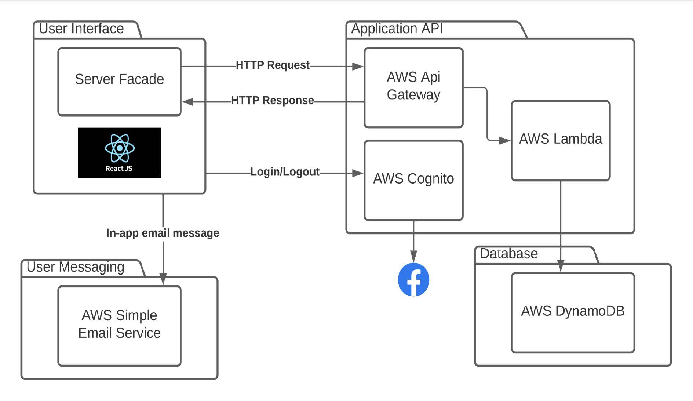

# Roomer

Roomer is an app/website that reverses the housing market. Simply put, Roomer strives to connect sellers to buyers through a buyer-focused marketplace.

For example, buyers create in-search-of posts (ISOs) of wanted housing.
IE: "_I'm looking for a one bedroom apt in Bellevue that is dog friendly, etc etc..._"

Sellers can browse those posts and message buyers about their open apartments/housing contracts.
IE: "_Hey, I think my apartment might be perfect for you.
We are located in the east side of Bellevue and have a dog friendly pet policy..._"

This repo contains the final MVP prototype. This prototype was created as the capstone project of 5 students over the course of two semesters.

The final prototype can be viewed at: [https://www.roomerhasit.net/](https://www.roomerhasit.net/)

The UX design can be see here: [https://www.figma.com/file/Z2QJRuX5a0RZ6fZ00GSlfp/Roomer](https://www.figma.com/file/Z2QJRuX5a0RZ6fZ00GSlfp/Roomer)

## Directories

- _[roomer-expo-app/](roomer-expo-app/)_ contains all the React Native files for the front end. Expo is used to run and deploy the application.
- _[Backend/](Backend/)_ contains the lambda layer files used in AWS Lambda Layers. [Backend/DAO/Dao](Backend/DAO/Dao) contains the code used for each Lambda Function.
- _[Roomer.fig](Roomer.fig)_ contains the Figma file of the UX design and prototype (which can be see online: [figma.com/file/Z2QJRu...](https://www.figma.com/file/Z2QJRuX5a0RZ6fZ00GSlfp/Roomer)).

## Tech Stack

- React Native (frontend)
- Expo (continuous integration and deployment)
- AWS (backend)
  - API Gateway (gateway for all backend endpoints)
  - Lambda (cloud functions triggered by Gateway, Lambda layer contains att Data Access Object files)
  - Cognito (user authentication)
  - Amplify (hosts website client)
  - DynamoDB (database for user table (not user credentials)
  - EC2 (runs the MongoDB server)
  - Simple Email Service (SES) (messaging between users)
- MongoDB (document database for posts)
- Google Maps (map/POI)
- Figma (prototype)

